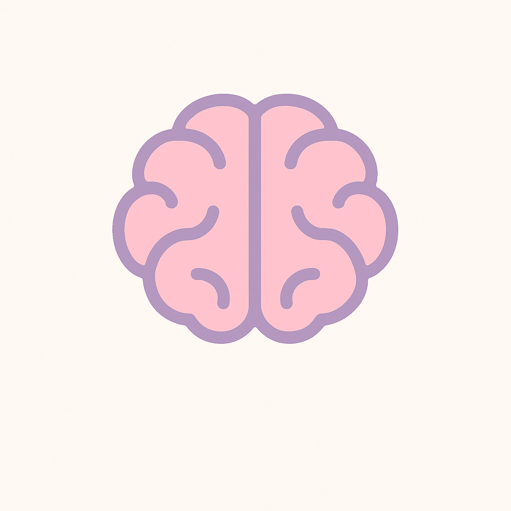

# 🧠 Noggin - Brain Training App

**Wake up your brain in just 4 minutes each day!**

Noggin is a minimalist, playful web application designed to help users sharpen their cognitive abilities through a series of engaging brain-training challenges. Built with React and TypeScript, it provides a seamless, linear experience that tests speed, focus, logic, and memory.

## 🎮 How to Play

1. **Start**: Click the "start" button on the home page
2. **Speed Challenge**: Tap the highlighted shape as quickly as possible
3. **Focus Challenge**: Find and click the shape that appears only once
4. **Logic Challenge**: Select the correct answer to the logic puzzle
5. **Memory Challenge**: Memorize the symbol sequence, then recreate it
6. **Results**: View your performance breakdown and scores

## 🎯 Scoring System

Each challenge contributes to your overall brain training score:

- **Speed**: Based on reaction time and accuracy
- **Focus**: Time to find the unique shape
- **Logic**: Correctness of reasoning
- **Memory**: Accuracy of sequence recreation

## 📝 License

**Copyright (c) 2025 Jacob Rose-Seiden**

This code is provided for demonstration and portfolio purposes only.

**Permission is NOT granted to:**

- Copy, modify, or distribute this code
- Create derivative works
- Use this code in any commercial or non-commercial projects
- Fork or clone this repository for any purpose other than viewing

This code is made available solely for the purpose of demonstrating programming skills to potential employers and may not be used for any other purpose without explicit written permission from the author.

**All rights reserved.**

## 🙏 Acknowledgments

- Inspired by cognitive training research and brain training methodologies
- Built with modern web technologies for optimal performance
- Designed with accessibility and user experience in mind
- Used Figma Make for wireframes and baseline code

## 📞 Contact

- **LinkedIn**: https://www.linkedin.com/in/jacobroseseiden
- **Email**: jacobroseseiden.prof@gmail.com

---

**Ready to wake up your brain? Start your 4-minute daily training session today!** 🧠✨
